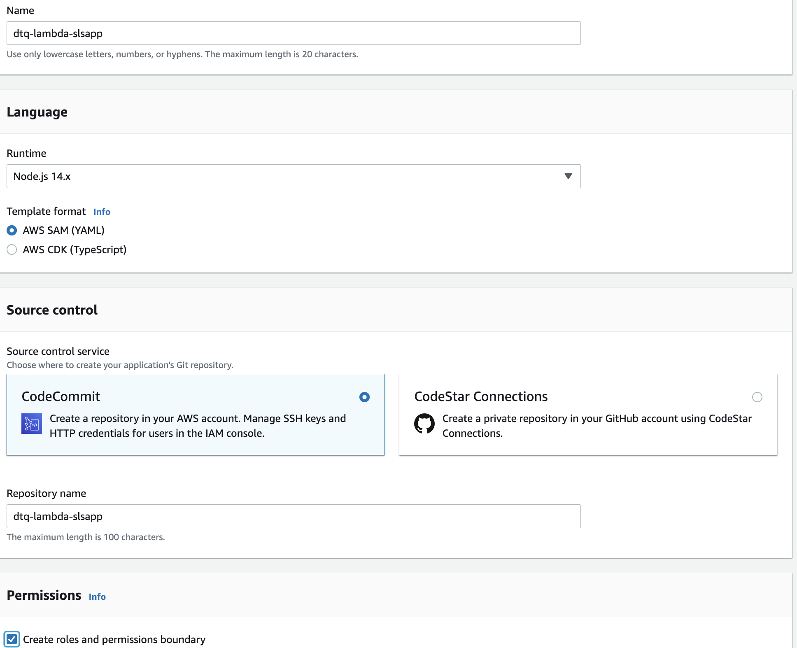
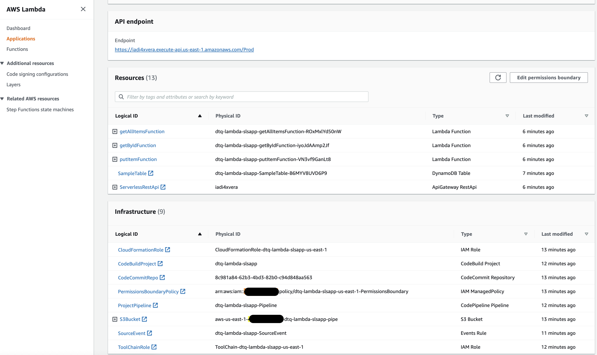
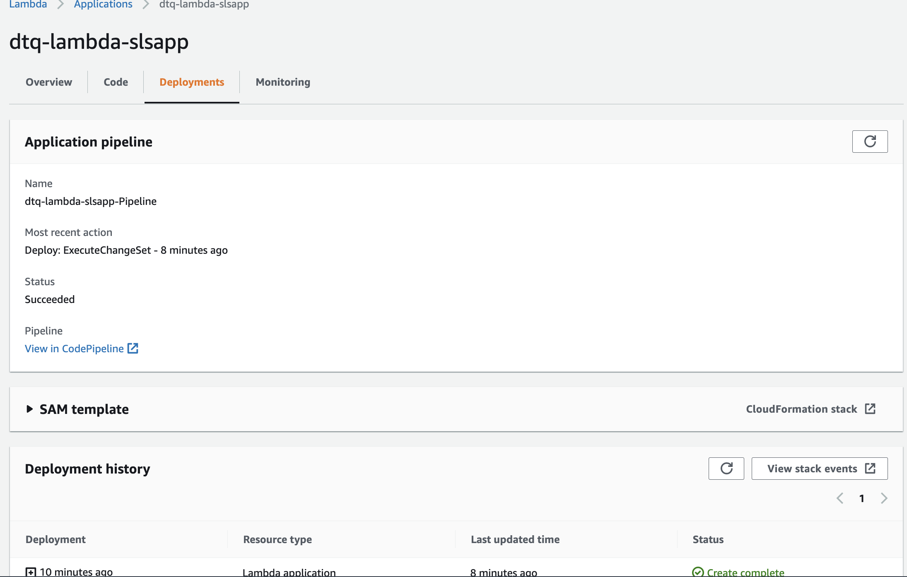
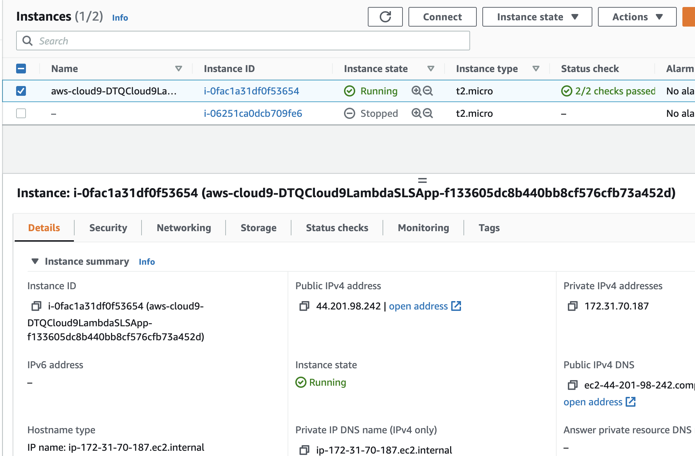
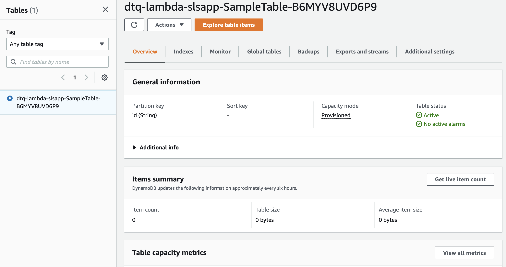
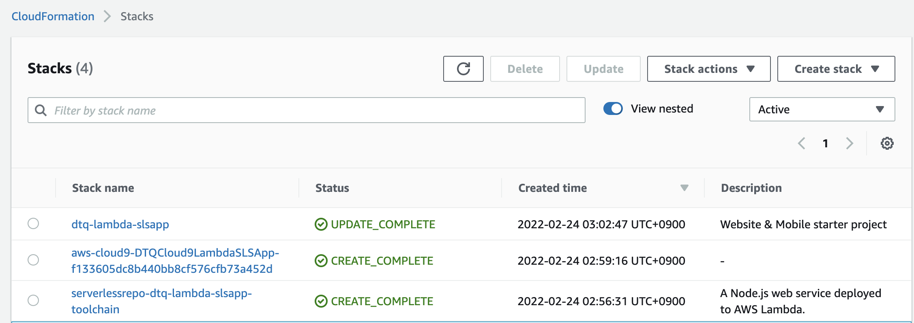
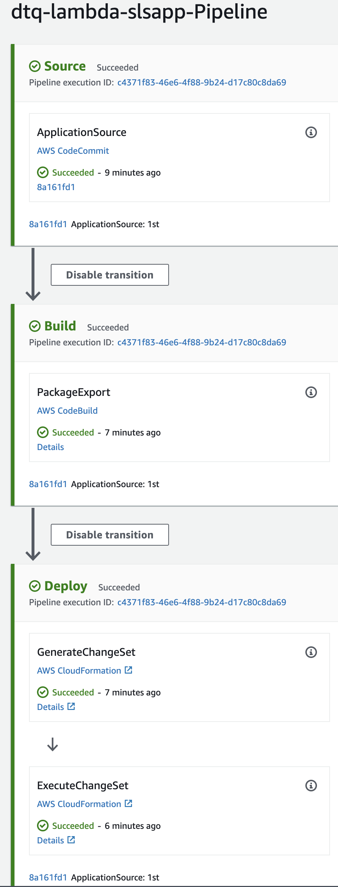
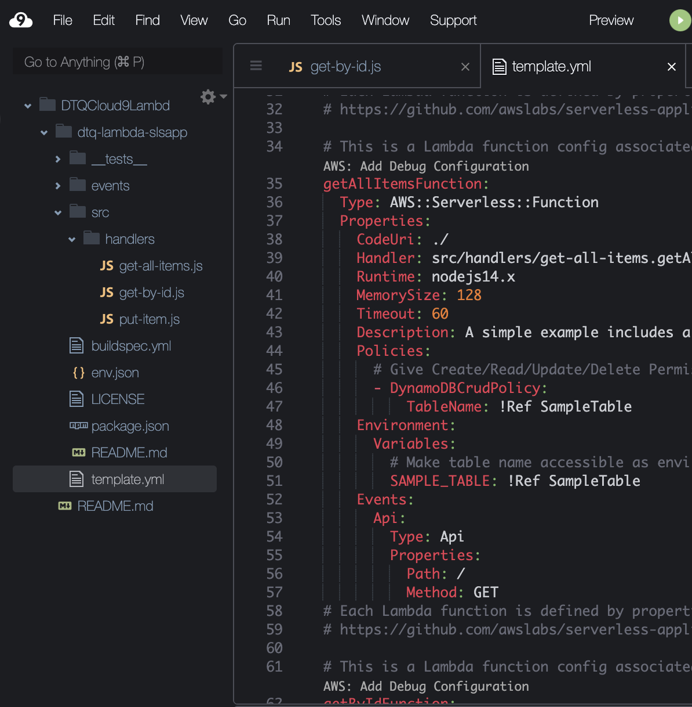
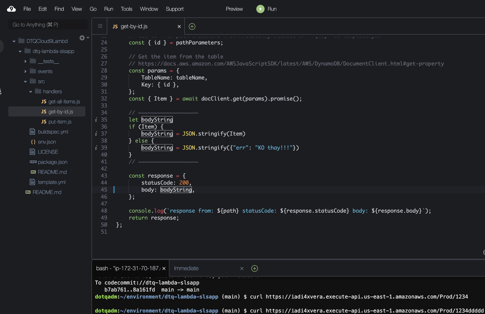

# aws-lambda-slsapp-sample-cloud9-demo 🐳


[](https://github.com/tquangdo/aws-lambda-slsapp-sample-cloud9-demo/issues/new)

## reference
[youtube](https://www.youtube.com/watch?v=mIky1niHGdY)

## lambda
- name=`dtq-lambda-slsapp`

---

---


## ec2
- name=`aws-cloud9-DTQCloud9LambdaSLSApp-...`


## dynamodb
- name=`dtq-lambda-slsapp-SampleTable--...`


## cloudformation


## pipeline


## cloud9
- name=`DTQCloud9LambdaSLSApp`
- auto created `/dtq-lambda-slsapp/template.yml`

- `git clone codecommit://dtq-lambda-slsapp && cd dtq-lambda-slsapp` 
- `curl https://iadi4xvera.execute-api.us-east-1.amazonaws.com/Prod/xxx` -> see nothing
- edit `bodyString` variable in `get-by-id.js`

```shell
git add --all
git commit -m "1st"
git push
```
- after CICD finished, `curl https://iadi4xvera.execute-api.us-east-1.amazonaws.com/Prod/xxx` -> see:
```json
{"err": "KO thay!!!"}
```
